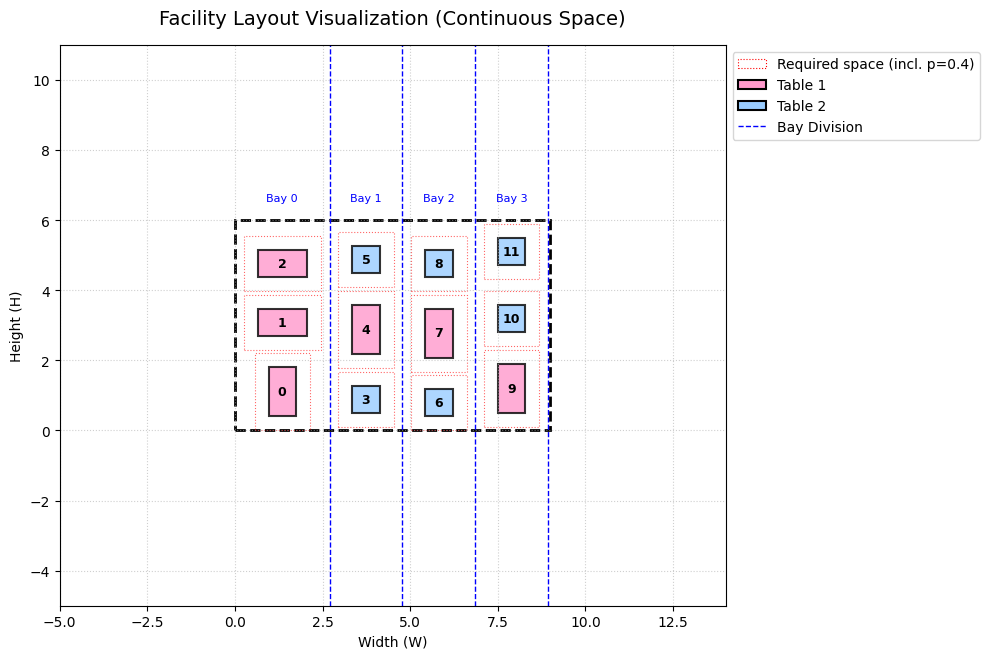

# 🍽️ Restaurant Layout Optimization using Flexible Bays 

> A Mixed-Integer Linear Programming (MILP) approach to solve the continuous-space Facility Layout Problem (FLP) for a restaurant, balancing maximum capacity with customer comfort.

## 📌 Overview
Restaurant owners constantly face a layout dilemma: packing too many tables ruins the dining experience and makes it difficult for waiters to move, while placing too few tables results in lost potential revenue. 

This repository contains an optimization model that designs a restaurant floor plan using a **Flexible Bays (Alternating Bays)** structure. Instead of simply cramming tables, the model dynamically generates straight service aisles while optimizing table placement to maximize business profit and circulation space.

## 🧠 Methodology
The problem is modeled as a continuous-space **Facility Layout Problem (FLP)** using Mixed-Integer Linear Programming (MILP).

### Multi-Objective Function:
The objective function is a weighted normalization of three conflicting goals:
1. **Maximize Capacity:** Number of active tables.
2. **Maximize Comfort:** Total Manhattan distance between tables (proxy for free circulation space).
3. **Maximize Revenue:** Prioritizing higher-margin tables when space permits.

### Key Constraints:
- **Flexible Bays System:** Tables are strictly assigned to active bays, while dynamically adjusting bay widths based on the largest table placed inside.
- **Symmetry Breaking:** Eliminating duplicate configurations by forcing ordered table usage and strict vertical positioning, drastically reducing the search space and solver time.
- **Non-Overlapping:** Strict collision avoidance on both $X$ and $Y$ axes.

## 📊 Results & Visualization
Using a simulated $9m \times 6m$ room area with two table types, the Gurobi solver successfully balanced the trade-offs. 

**Key Findings:**
* The model allocated exactly **12 tables** (6 Type I and 6 Type II) across **4 dynamically generated bays**.
* Despite smaller tables being easier to pack, the solver strategically selected higher-margin Type I tables for 50% of the layout due to the revenue weight parameter.

 

## 📖 Read the Full Article

For a deep dive into the business context, mathematical formulation, and the logic behind the constraints, read my full article on Medium:

👉 [Giving Restaurant Customers Comfort Through Layout Optimization](https://medium.com/@banusuharyadi07/giving-restaurant-customers-comfort-through-layout-optimization-269dc8f0723d?sharedUserId=banusuharyadi07)

